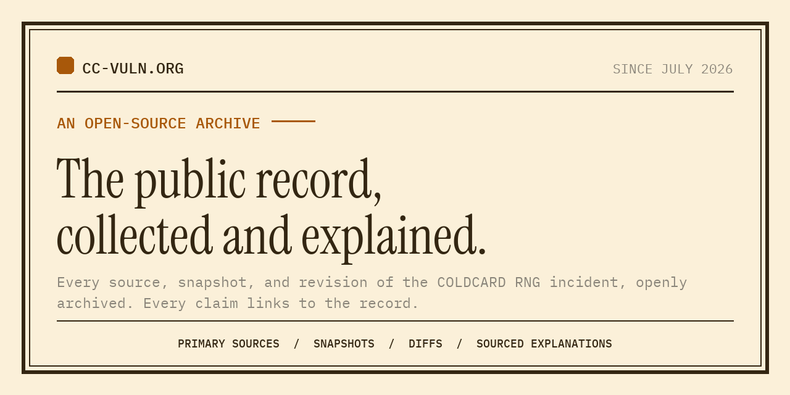

# COLDCARD entropy incident archive

An open source collection and presentation of what has been published about the
July 2026 COLDCARD predictable-RNG incident.

The site is the public record of the July 2026 COLDCARD predictable-RNG
incident: it preserves what each party published and how it changed, organises
the material, and explains it without adjudicating between the people involved.

The project's historical role is to preserve the contemporaneous public record
for posterity, so future readers can assess the incident from what participants
published at the time, including material later edited or removed. The record
also organises explanations, opinions and speculation chronologically so
readers can understand how public interpretation changed, sometimes within
hours. Conspiracy theories are retained only as dated, attributed reaction,
never as evidence that they were true.

The material is scattered across vendor advisories that get edited, threads that
scroll away, repositories, blog posts and reporting that restates other
reporting. Collecting it and making it legible is the product. Everything here
is public and reusable: the captures, the tooling that takes them, the review
record and the site itself, so anyone can re-run the captures, check the record
against the originals, or take the material and do something else with it.

The project has three parts that reinforce each other:

- **The archive**, this repository's spine: a primary-source record built to
  answer one question that gets harder to answer every day: **what did each
  party actually say, and when did they change it?**
- **The repository**, [github.com/cc-vuln/coldcard-rng-incident](https://github.com/cc-vuln/coldcard-rng-incident):
  the captures, the tooling that takes them, the review record and the site
  source, all under licences that permit reuse.
- **The site**, [cc-vuln.org](https://cc-vuln.org): presents the source record,
  a technical explanation of how the failure worked, and attributed accounts
  of how vendors, researchers, developers and others responded.

Nothing is solicited or sold. There is no donation address, no sponsorship and
no advertising. What the project wants is corrections, sources it has missed,
and code.

Impartiality here is a mechanism, not a promise. Every material claim carries
an evidence basis (verified, reported, derived or unverified, with contested
where sources disagree), and verified or reported claims link to re-checkable
artefacts. The project reports and attributes; it does not adjudicate. Where
the parties involved give different numbers, all of them are shown alongside
what each assumes.

Vendor advisories during a live incident are mutable. The Coinkite Mk3 advisory
stated at 01:56 UTC on 31 July that "Mk4, Q and Mk5 are not affected based on
our early analysis of the issue" and that the issue was "present through
firmware version 5.0.3, the final release that supported Mk3". By 07:30 UTC the
same page said those models were "also affected, with about 72 bits of entropy",
and the 5.0.3 claim was gone. By the following day firmware had shipped for every
model including a revived Mk3 build. None of the earlier text survives on the
live page.

Every one of those states is held here, with diffs between them. Our own capture
started after the first revision, so the two pre-revision states were recovered
from the Internet Archive and are marked `provenance: wayback` in their metadata.
That distinction is deliberate: you should always be able to tell which captures
this project took and which it inherited.

This repo can poll tracked sources, stores a snapshot **only when the
source-specific comparison text changes**, and keeps a diff of what moved. A
single recurring timer runs source groups at cadences matched to their
mutability without coupling capture to publication.

## What is here

```
sources.toml              tracked sources, tiered by mutability and value
revision-reviews.toml      additive review of detected differences
corrections.toml          this project's own corrections, published at /corrections/
CITATION.cff              repository citation metadata
scripts/capture.py        fetch, extract text, hash, diff, log     (stdlib only)
scripts/capture-x.sh      manual X post capture via gallery-dl
scripts/notify.sh         capture, alert on change or incomplete poll
scripts/scheduled_runner.py
                          due-state runner for recurring known-URL capture
scripts/verify_mk3_vector.py
                          fixed synthetic RNG-to-xpub regression vector
archive/
  snapshots/<id>/<TS>.{html,txt,meta.json}
  diffs/<id>/<TS>.diff
  index.jsonl             append-only event log: every poll, changed or not
  runs/<TS>-p<PID>.json   structured result for every non-dry capture
  CHANGES.md              human-readable change log (created on first detected change)
  x/                      captured posts and media
docs/
  README.md               document index and placement rules
  capture.md              capture methods, normalisers, failures, X and Wayback
  operations.md           scheduled capture, the one-writer rule, alerting, deploy
  publication.md          what the published site shows; machine-readable outputs
  design/                 future-facing technical designs
  research/               open research work packages
  reviews/                durable inputs behind dated publication calculations
site/                     Astro front end, reads archive/ at build time
  /llms.txt               generated machine orientation and citation guidance
  /record/sources.json    generated source and capture-status register
  /record/changes.json    generated JSON Feed of detected differences
  /version.json           the commit a build was made from, and the record's size
  /cite/                  citation guidance and what a citation here asserts
  /corrections/           corrections to published claims, from corrections.toml
  /schemas/source-register-v1
                           JSON Schema for the source register
```

Temporary audits, screenshots and generated review evidence belong under
`.work/`, which is ignored. They are working material, not project documentation.

Snapshots are timestamped UTC (`YYYYMMDDTHHMMSSZ`). Every snapshot sidecar
carries the SHA-256 of both the raw bytes and the extracted text. The capture
tool uses comparison hashes to detect changes, and the audit recomputes the
extracted-text hash to catch later mutation of that held text. The raw-byte hash
remains capture metadata. None of these hashes authenticates who made a
capture, so the public site does not present them as independent proof of
provenance.

## Usage

```bash
just setup            # venv + gallery-dl, once
just capture          # poll everything, store what moved
just capture-urgent   # tier 1 only: the mutable vendor advisories
just test             # capture regressions plus the fixed synthetic vector
just test-capture     # registry, normalisation, lock and X-capture regressions
just test-vectors     # independently verify the fixed synthetic Mk3 path
just audit            # capture contract and source-registry publication gate
just check-claims     # claim basis, scope, provenance links and page coverage
just check-public-output
                      # generated public files contain no operational details
just status           # what is tracked, when each last moved
just schedule-tick    # run one due-state tick in the foreground
just log              # chronological change events
just show coinkite-backgrounder
just stats
```

`capture.py` exits **10** only when a healthy run found a change. Exit **20**
means at least one source errored, was blocked, or had to be skipped, even if a
different source changed. Exit **21** means another archive writer owns the
lock.

The detail behind these commands lives in three documents:

- [docs/capture.md](docs/capture.md): capture methods, change normalisation,
  failure classes, withdrawn sources, Wayback recovery, X capture and the
  review layer for detected differences
- [docs/operations.md](docs/operations.md): the recurring capture schedule,
  the one-writer rule, notification delivery, Signal alerting and deployment
- [docs/publication.md](docs/publication.md): what published builds show, the
  editorial claim-marker contract and the machine-readable outputs

## Adding a source

Append to `sources.toml` and run `just capture`. Nothing else needed. Removing a
source stops future polling and keeps its accumulated history.

```toml
[[source]]
id = "some-advisory"
title = "Human-readable advisory title"
url = "https://example.com/advisory"
org = "Example"
kind = "vendor-advisory"
tier = 1
note = "why this one matters"
```

When an origin withdraws a page for good, mark the source `gone` rather than
leaving it to fail every poll; the fields and the reasoning are in
[docs/capture.md](docs/capture.md#when-a-source-disappears).

## Contributing

Contributions are welcome: new sources, corrections with evidence, difference
classifications, normalizer improvements and site clarity work. Read
[CONTRIBUTING.md](CONTRIBUTING.md) first; the ground rules there (report and
attribute without adjudicating, append-only archive, evidence markers on every
material claim) are what the project is, not style preferences. Security
reports go to [SECURITY.md](SECURITY.md).

## Licensing

Three-way split, because the project can only license what it created: the
software is MIT ([LICENSE](LICENSE)); the project's own writing, diagrams and
data are CC BY 4.0 ([LICENSE-CONTENT.md](LICENSE-CONTENT.md)); archived
third-party material under `archive/` remains its authors' copyright, held
here for research and archival purposes. Mirror the code and the writing
freely with attribution.

## Citing this

Cite the original publisher first and this archive second: what a party said is
theirs, and what this project adds is the preserved state, the time it was
observed and the record that the state existed. A citation naming only
cc-vuln.org attributes someone else's statement to us.

The record changes, so name the state you read. Every build stamps the commit it
was made from in the page footer and at
[/version.json](https://cc-vuln.org/version.json); quoting that commit alongside
the URL makes the state recoverable from this repository. Worked examples,
BibTeX and CSL-JSON, and what a citation here does and does not assert are at
[cc-vuln.org/cite](https://cc-vuln.org/cite/). Repository citation metadata is
in [CITATION.cff](CITATION.cff). No DOI is minted.

Corrections to published claims are marked on the page and listed at
[cc-vuln.org/corrections](https://cc-vuln.org/corrections/), from
[corrections.toml](corrections.toml). Sources changing their own pages are not
corrections: those are the record's subject and live in the change record.

## Provenance and limits

- Snapshots are what a normal browser would have received from that URL at
  that time. Each capture's metadata records its collection method, and
  `revision-reviews.toml` classifies differences that trace to collection
  changes rather than source changes.
- Text extraction is deterministic, so an unchanged hash across two polls is
  meaningful. Raw HTML changes constantly (nonces, timestamps, CDN headers) and
  is stored for changed captures only.
- `index.jsonl` records every poll including unchanged ones, which is what lets
  you bound when a change happened rather than only that it happened. One
  documented gap: the 4 August 2026 reddit-json migration removed the earlier
  poll records of five Reddit sources along with their captures, so those
  sources begin on 4 August. It is logged at
  [/corrections/](https://cc-vuln.org/corrections/), and the append-only rule
  has been enforced without exception since 6 August 2026.
- This is not a legal evidentiary chain. No timestamping authority, no
  signatures. If that matters for a given source, submit it to the Wayback
  Machine as well and record the permalink.
- Archived third-party content is held for research and historical purposes.
  Copyright remains with the original authors.
